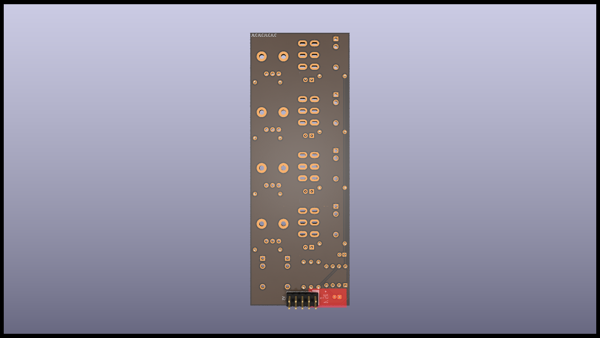

# Populate Manual for MS20-VCF

Follow this manual to populate the PCB: 

The basic rule is, always go from the smallest to the highest component on the board !

####  This is the front side of the board we are populating

 This is the back side of the board we are populating.

####  This is the back side of the board we are populating.

 You can start by all the resistors (by value so you don't make mistakes)

####  You can start by all the resistors (by value so you don't make mistakes)

####  Add the socket for the TL072, making sure you get the orientation right. Don't add the Tl072 yet, you'll add it at the end. 

####  Add the electrolytic capacitors.

The last step concern the jacks, potentiometers, LEDs and switches. Basically, anything that is accessible throught the front panel. You first place them.

:warning: DO NOT SOLDER THEM YET :warning:

(this is really important !!)

####  Do Not Solder Them! place them first and put the front panel in place. You'll be able to put the" knobs of your choice on those.

You can place the TL0&" in place before you put the front panel on.

You then put in place the front panel, making sure everything fits. Once all the jack sockets and switches are fastenned to the front panel, you can solder them, and only then !!!

The front is done, we can flip the PCB and start the back !

####  Add the power header and that's it !

## Conclusion

This is the end of the build, if yoy have any questions, don't hesitate !

